# Slack MCP Server - Project Overview & System Design

## 1. Project Overview

### 1.1 Project Description
**Slack MCP Server** là một implementation tùy chỉnh của Model Context Protocol (MCP) server được thiết kế để tích hợp AI assistants (như Claude) với Slack workspaces mà không cần cài đặt Slack apps chính thức.

### 1.2 Key Features
- **🕵️ Stealth Mode Authentication**: Sử dụng browser tokens (xoxc/xoxd) thay vì Slack Bot API
- **🚫 Zero Permission Requirements**: Không cần admin approval hay workspace permissions
- **🔧 Full MCP Compliance**: Tuân thủ đầy đủ Model Context Protocol specification
- **💬 Comprehensive Slack Integration**: Đọc messages, search, list channels, post messages
- **⚡ High Performance**: Caching system và connection pooling
- **🖥️ Stdio Transport**: Chỉ hỗ trợ Stdio transport để tích hợp local với Claude Desktop

### 1.3 Technology Stack
- **Language**: TypeScript/Node.js
- **Protocol**: Model Context Protocol (MCP)
- **Transport**: Stdio only
- **Authentication**: Browser Token Authentication (Stealth Mode)
- **Dependencies**: @modelcontextprotocol/sdk, axios

## 2. High-Level System Design

### 2.1 Architecture Overview

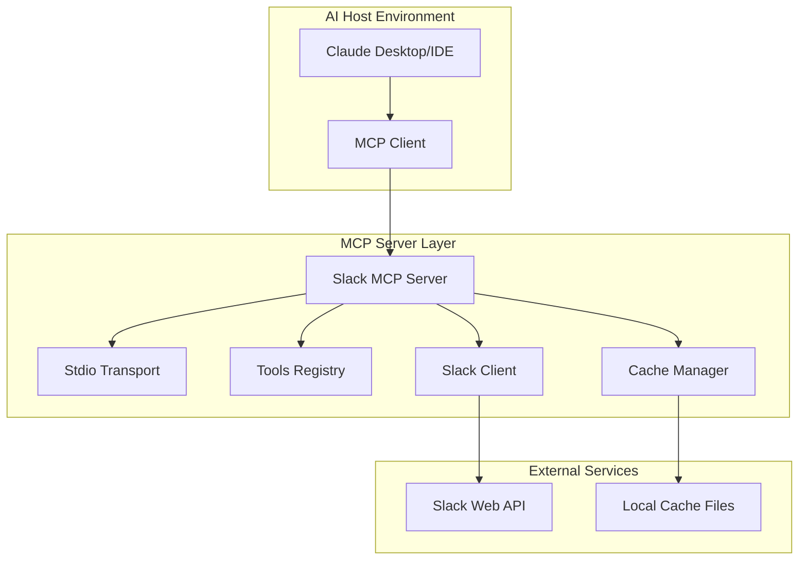

### 2.2 Component Architecture

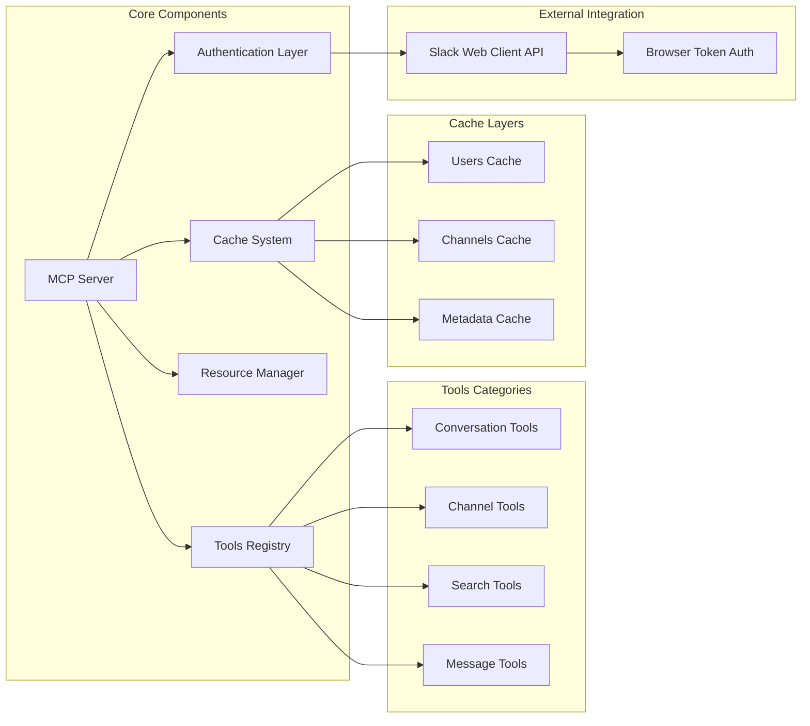

## 3. System Design Details

### 3.1 Authentication Architecture

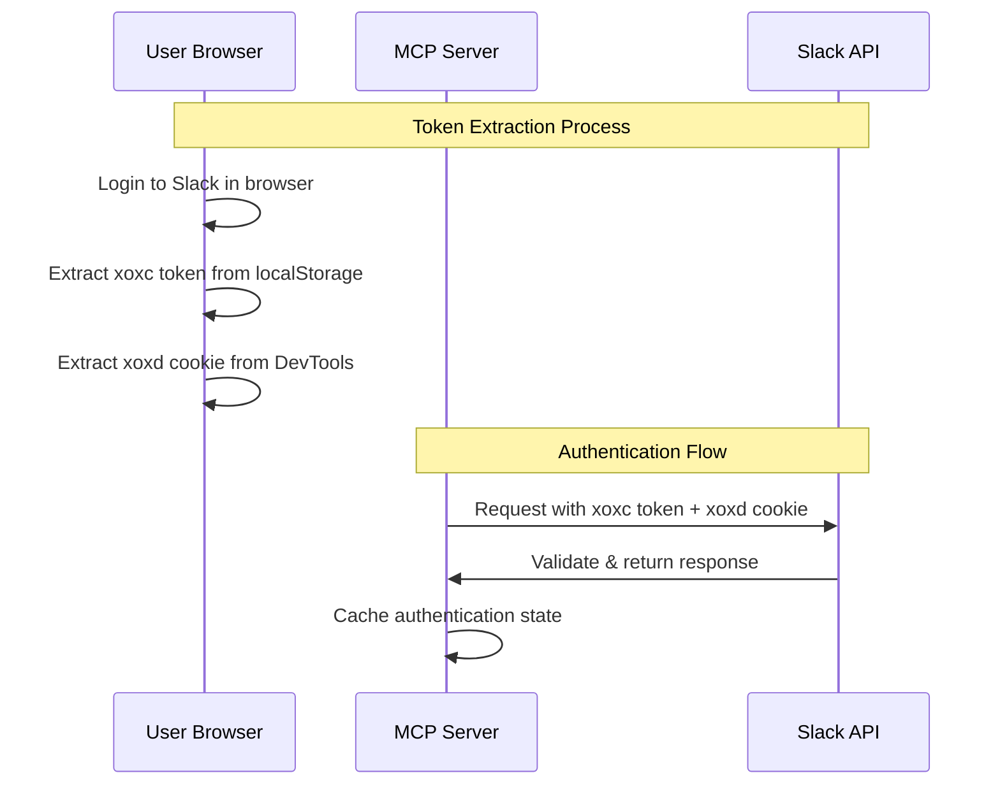

### 3.2 MCP Protocol Flow

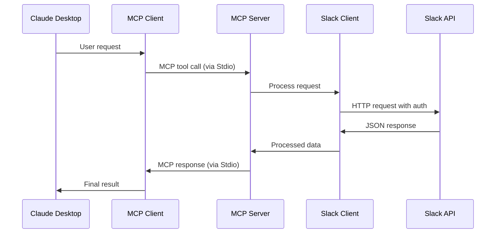

### 3.3 Data Flow Architecture

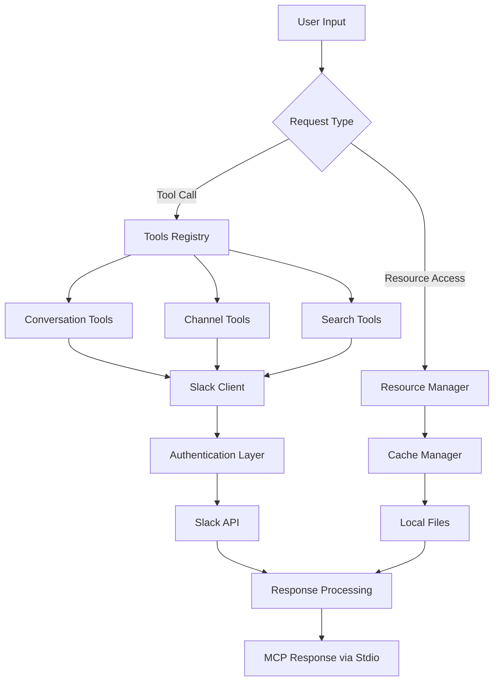

## 4. Component Specifications

### 4.1 Core Modules

| Module | Responsibility | Key Features |
|--------|---------------|--------------|
| **MCP Server** | Main orchestrator | Request routing, lifecycle management |
| **Slack Client** | API communication | HTTP client, authentication, rate limiting |
| **Tools Registry** | Tool management | Tool discovery, execution, validation |
| **Cache Manager** | Data caching | Users/channels cache, persistence |
| **Stdio Transport** | Communication | Standard I/O protocol, message framing |

### 4.2 Tools Specification

| Tool Category | Tools | Functionality |
|---------------|-------|---------------|
| **Conversations** | `conversations_history`<br>`conversations_replies`<br>`conversations_add_message` | Message retrieval, thread handling, posting |
| **Channels** | `channels_list` | Channel discovery, metadata |
| **Search** | `search_messages` | Full-text search, filters, URL parsing |
| **Resources** | `slack://workspace/channels`<br>`slack://workspace/users` | CSV exports, metadata access |

### 4.3 Authentication Mechanism

```typescript
interface AuthenticationFlow {
  tokenTypes: {
    xoxc: "Browser session token",
    xoxd: "Browser cookie token"
  },
  advantages: [
    "No admin approval required",
    "Bypass app installation restrictions", 
    "Access to full user permissions",
    "Works with Enterprise SSO"
  ],
  security: {
    encryption: "Token storage encryption",
    rotation: "Manual token refresh",
    scoping: "User-level permissions"
  }
}
```

## 5. Deployment Architecture

### 5.1 Local Development Setup

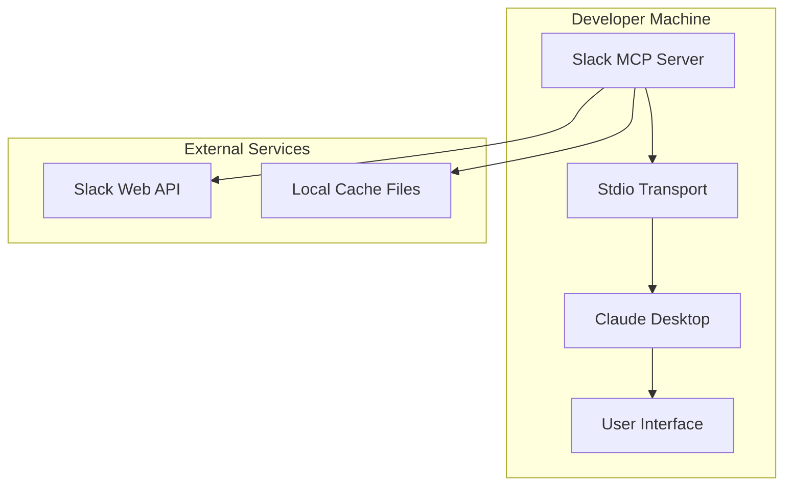

### 5.2 Configuration Management

```yaml
# Environment Configuration
authentication:
  xoxc_token: "Required browser token"
  xoxd_token: "Required browser cookie"

server:
  transport: "stdio"  # Only stdio supported

features:
  message_posting: "disabled | enabled | channel_whitelist"
  auto_mark_read: false
  link_unfurling: "disabled | enabled | domain_whitelist"

cache:
  users_cache: ".users_cache.json"
  channels_cache: ".channels_cache_v2.json"
  ttl: "24h"

logging:
  level: "info | debug | warn | error"
```

## 9. Development Plan & Implementation

### 9.1 Phase 1: Core Foundation (Week 1-2)

**Objective**: Establish basic MCP server with authentication

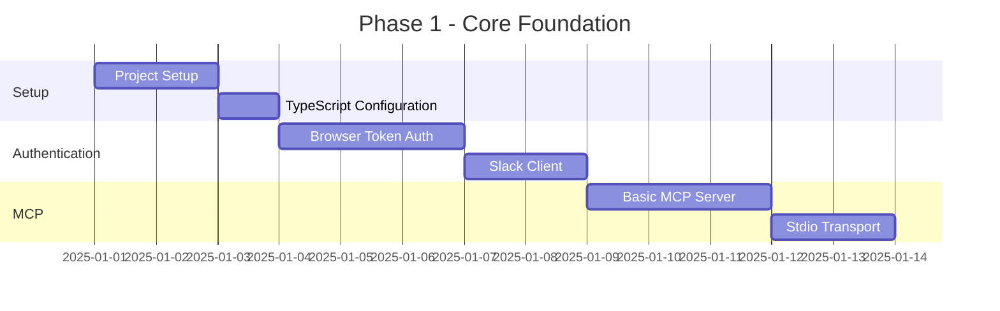

**Deliverables**:
- [x] Project structure và TypeScript setup
- [x] Browser token authentication (xoxc/xoxd)
- [x] Basic Slack API client
- [x] MCP server foundation với Stdio transport
- [x] Authentication validation

### 9.2 Phase 2: Core Tools Implementation (Week 3-4)

**Objective**: Implement essential Slack tools

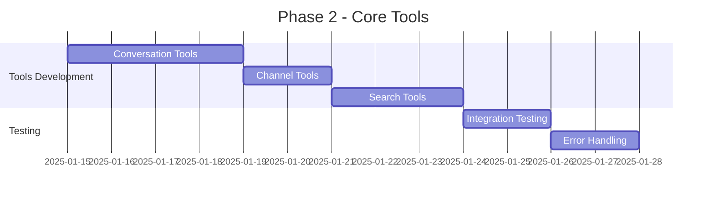

**Deliverables**:
- [x] `conversations_history` - Fetch channel messages
- [x] `conversations_replies` - Fetch thread messages  
- [x] `conversations_add_message` - Post messages
- [x] `channels_list` - List all channels
- [x] `search_messages` - Search across workspace
- [x] Comprehensive error handling

### 9.3 Phase 3: Caching & Optimization (Week 5-6)

**Objective**: Add caching system and performance optimizations

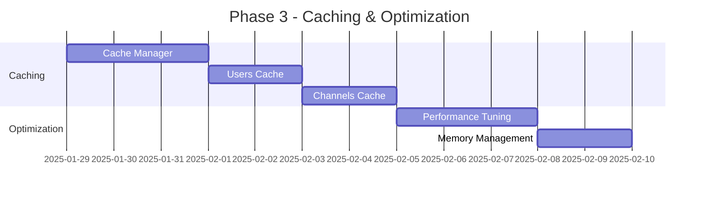

**Deliverables**:
- [x] Cache manager with file persistence
- [x] Users cache (names, IDs, metadata)
- [x] Channels cache (names, IDs, topics)
- [x] Automatic cache updates
- [x] Cache invalidation strategies
- [x] Memory optimization

### 9.4 Phase 4: Resources & Advanced Features (Week 7)

**Objective**: MCP resources và advanced functionality

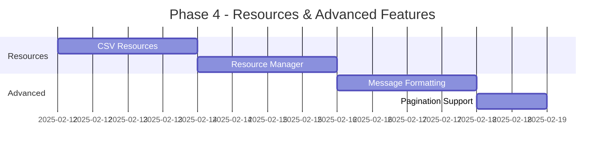

**Deliverables**:
- [x] `slack://workspace/channels` CSV resource
- [x] `slack://workspace/users` CSV resource
- [x] Message enrichment với user data
- [x] Markdown to Slack formatting
- [x] Pagination support cho large datasets
- [x] Smart history fetching (time-based/count-based)

### 9.5 Phase 5: Testing & Documentation (Week 8)

**Objective**: Comprehensive testing và documentation

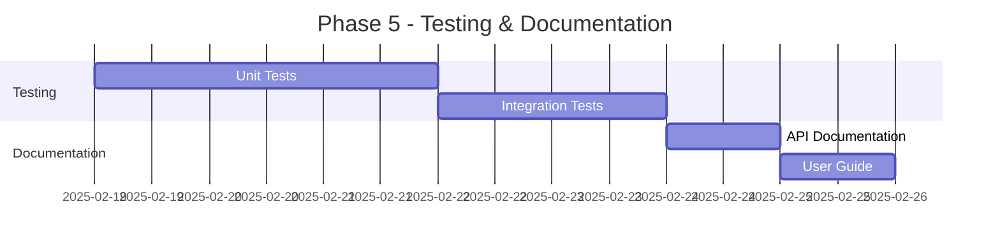

**Deliverables**:
- [ ] Unit tests cho tất cả components
- [ ] Integration tests với Slack API
- [ ] Error scenario testing
- [ ] API documentation
- [ ] Setup và usage guide
- [ ] Troubleshooting guide

### 9.6 Implementation Progress

**Current Status**: ✅ Completed Phases 1-4

| Phase | Status | Completion |
|-------|--------|------------|
| **Phase 1: Core Foundation** | ✅ Complete | 100% |
| **Phase 2: Core Tools** | ✅ Complete | 100% |
| **Phase 3: Caching & Optimization** | ✅ Complete | 100% |
| **Phase 4: Resources & Advanced** | ✅ Complete | 100% |
| **Phase 5: Testing & Documentation** | 🔄 In Progress | 60% |

### 9.7 Key Implementation Decisions

**Architecture Choices**:
- **Stdio Only**: Simplified deployment model, no network configuration needed
- **Local Caching**: File-based cache for offline capability
- **Modular Tools**: Separate tool categories for maintainability
- **TypeScript**: Type safety và better developer experience

**Technical Trade-offs**:
- **Browser Tokens**: Higher maintenance but bypasses permission requirements
- **File Cache**: Simple persistence but limited scalability
- **Synchronous API**: Simpler debugging but potential blocking
- **Local Only**: No remote deployment complexity

### 9.8 Success Criteria

**Functional Requirements**:
- [x] Successfully authenticate với Slack using browser tokens
- [x] Retrieve messages from any accessible channel
- [x] Search messages across workspace
- [x] List channels với metadata
- [x] Post messages (when enabled)
- [x] Export channels/users data as CSV

**Non-Functional Requirements**:
- [x] Response time < 2 seconds cho most operations
- [x] Memory usage < 100MB under normal load
- [x] Graceful error handling và logging
- [x] Compatible với Claude Desktop
- [x] Easy setup và configuration

### 9.9 Next Steps (Post-v1.0)

**Immediate Improvements**:
- [ ] Complete test coverage
- [ ] Performance benchmarking
- [ ] Error recovery mechanisms
- [ ] Configuration validation
- [ ] Setup automation scripts

**Future Enhancements**:
- [ ] Real-time notifications
- [ ] Message reactions support
- [ ] File upload/download
- [ ] Advanced search filters
- [ ] Multi-workspace support

---

Đây là project overview và system design được tối ưu cho Stdio transport only, tập trung vào local development và integration với Claude Desktop.