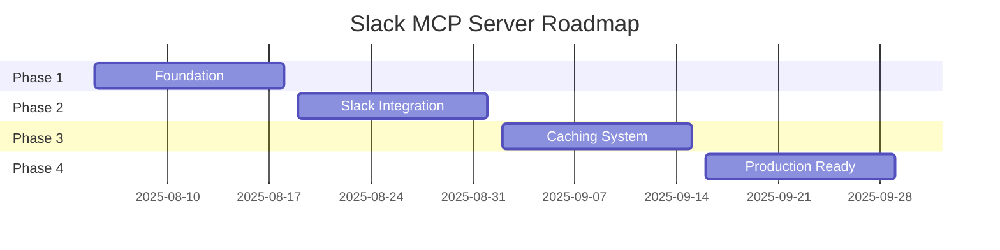

# Slack MCP Server - Roadmap

> 🎯 **Mission**: AI assistants tương tác với Slack seamlessly trong 5 phút setup  
> 📅 **Timeline**: 8 w## 📋 Current Focus (Week 1: Aug 5-11)

### This Week's Priorities

1. _📅 **Update Schedule**: End of each phase và weekly during active development_  
   *📅 **Last Updated**: 2025-08-05 (Project initialization)*Project initialization\*\* (Priority 1)
   - Setup TypeScript/Node.js project structure
   - Install MCP SDK dependencies
   - Create basic server scaffold

2. **MCP Server Core** (Priority 2)
   - Implement basic MCP server với stdio transport
   - Setup tool registry architecture
   - Test connection với Claude Desktop

### Next Week Preview (Week 2: Aug 12-18)

1. **Development environment**
   - Complete build system setup
   - Environment configuration
   - Testing framework

2. **Basic tool structure**
   - Tool interface definitions
   - Error handling framework, 2025)
     > 📋 **Status**: Project initialization phase  
     > 📋 **Context Docs**: [Requirements](../00_context/project-requirement.md) | [Implementation](../00_context/implementation-detail.md) | [Caching Strategy](../00_context/about-caching.md)

---

## 📊 Phases Overview

---

## 🏗️ Phase 1: Foundation ✅ COMPLETED

**Duration**: Aug 5 - Aug 18 (2 weeks)  
**Objective**: Build MCP server core infrastructure  
**Reference**: [Implementation Details](../00_context/implementation-detail.md#1-project-structure)

### Key Deliverables ✅

- ✅ MCP server framework với stdio transport
- ✅ Tool registry system architecture
- ✅ Development environment setup
- ✅ Basic documentation structure

### Success Criteria ✅

- ✅ Server starts và accepts MCP connections
- ✅ Tool registration system works
- ✅ Test client integration verified
- ✅ Development workflow established

### Sprint Breakdown

- **Sprint 1.1** (Aug 5-11): ✅ [MCP Server Core Setup](../02_implementation/sprints/sprint_1_1.md) - COMPLETED
- **Sprint 1.2** (Aug 12-18): ✅ [Tool Architecture & Dev Environment](../02_implementation/sprints/sprint_1_2.md) - COMPLETED

### 🎯 Phase 1 Final Results:

- **Working Tools**: 2 tools (ping, echo) with full validation
- **System Resources**: 5 resources providing server monitoring
- **Performance**: 61ms connection, 0.4ms tool execution
- **Architecture**: Complete MCP compliance với advanced features
- **Development**: VS Code debugging, testing framework, performance monitoring
- **Documentation**: Complete [Sprint 1.1](../02_implementation/sprints/sprint_1_1.md) & [Sprint 1.2](../02_implementation/sprints/sprint_1_2.md)

---

## 🔌 Phase 2: Slack Integration 📋 PLANNED

**Duration**: Aug 19 - Sep 1 (2 weeks)  
**Objective**: Core Slack operations với stealth authentication  
**Reference**: [Browser Token Auth](../00_context/implementation-detail.md#3-core-implementation) | [Slack API Integration](../00_context/project-requirement.md#31-authentication-architecture)

### Key Deliverables

- 📋 Browser token authentication (xoxc/xoxd)
- 📋 Message read/write operations
- 📋 Channel listing và user lookup
- 📋 Search functionality
- 📋 Integration testing với real workspace

### Success Criteria

- 📋 Authentication works với browser tokens
- 📋 All essential Slack tools functional
- 📋 AI can read và post messages via Claude
- 📋 Error handling cho common failures

### Sprint Breakdown

### Sprint Breakdown

- **Sprint 2.1** (Aug 19-25): [Authentication & Basic API](../02_implementation/sprints/sprint_2_1.md) - Browser token auth, core API client
- **Sprint 2.2** (Aug 26 - Sep 1): [Advanced Tools & Production](../02_implementation/sprints/sprint_2_2.md) - Complete tool suite, integration

---

## ⚡ Phase 3: Caching & Performance � PLANNED

**Duration**: Sep 2 - Sep 15 (2 weeks)  
**Objective**: Intelligent caching system cho performance optimization  
**Reference**: [Caching Strategy](../00_context/about-caching.md) | [Cache Implementation](../00_context/implementation-detail.md#src-cache-manager-ts)

### Planned Approach

- **Week 1 (Sep 2-8)**: User cache system
  - 📋 Architecture design
  - � Implementation và integration
  - 📋 Basic testing

- **Week 2 (Sep 9-15)**: Channel cache + optimization
  - 📋 Channel metadata caching
  - 📋 Message enrichment (ID → readable names)
  - 📋 Performance benchmarking

### Success Criteria

- 📋 90% reduction in API calls cho common operations
- 📋 Sub-second response times cho cached data
- 📋 Human-readable messages với user names
- 📋 Memory usage under 100MB cho typical workspaces

### Key Deliverables

- � **User cache system** - Persistent user profile caching
- 📋 **Channel cache system** - Channel metadata caching
- 📋 **Message enrichment** - Convert IDs to readable content
- 📋 **Performance optimization** - Response time và memory optimization

### Sprint Breakdown

- **Sprint 3.1** (Sep 2-8): [User Cache Implementation](../03_implementation/sprints/sprint_3_1.md)
- **Sprint 3.2** (Sep 9-15): [Channel Cache & Message Enrichment](../03_implementation/sprints/sprint_3_2.md)

---

## 🚀 Phase 4: Production Ready 📋 PLANNED

**Duration**: Sep 16 - Sep 29 (2 weeks)  
**Objective**: Polish implementation và prepare for public release  
**Reference**: [Requirements Completion](../00_context/project-requirement.md#9-development-plan--implementation) | [Advanced Features](../00_context/implementation-detail.md#4-mcp-tools-implementation)

### Planned Deliverables

- 📋 **Advanced features**: Thread support, file handling
- 📋 **Error recovery**: Robust error handling mechanisms
- 📋 **Complete documentation**: User và developer guides
- 📋 **Release package**: Distributable với installer
- 📋 **Security audit**: Comprehensive security review

### Success Criteria

- 📋 Complete feature set as per SRS
- 📋 Zero critical bugs in core functionality
- 📋 5-minute onboarding documentation
- 📋 Ready for public GitHub release

### Sprint Breakdown

- **Sprint 4.1** (Sep 16-22): [Advanced Features & Error Recovery](../03_implementation/sprints/sprint_4_1.md)
- **Sprint 4.2** (Sep 23-29): [Documentation & Release Preparation](../03_implementation/sprints/sprint_4_2.md)

---

## 🎯 Current Focus

**✅ Phase 1: Foundation (COMPLETED)**

- MCP framework hoàn thành với stdio transport
- Tool registry và factory pattern implemented
- Testing framework và debugging setup ready
- 5 system resources và 2 basic tools working

**� Phase 2: Slack Integration (IN PROGRESS)**

- **✅ Sprint 2.1: Authentication & Basic API (COMPLETED Aug 5, 2025)**
  - Real Slack API integration với browser tokens
  - 3 working Slack tools: list_channels, list_users, get_channel_history
  - Integration testing với live Slack workspace
  - **Status**: All objectives achieved ahead of schedule
- **🔄 Sprint 2.2: Advanced Tools (NEXT)**
  - Advanced messaging và search tools
  - File handling và user management
  - Performance optimization

---

## 🚨 Risks & Mitigation

| Risk                      | Impact | Mitigation                                            |
| ------------------------- | ------ | ----------------------------------------------------- |
| Slack API changes         | High   | Monitor API changelog, implement graceful degradation |
| Token expiration handling | High   | Clear error messages, refresh detection               |
| Performance bottlenecks   | Medium | Continuous benchmarking, incremental optimization     |
| Documentation lag         | Medium | Document-as-you-go approach                           |

---

## 🏁 Success Metrics

### Technical KPIs

- **Performance**: <2s response cho cached operations
- **Efficiency**: 90% API call reduction
- **Quality**: 95% test coverage, zero critical bugs
- **Reliability**: 99% uptime cho core operations

### User Experience KPIs

- **Onboarding**: <5 minutes from download to working
- **Context Quality**: Human names thay vì IDs in messages
- **Error Recovery**: Clear error messages với resolution steps

---

_📅 **Update Schedule**: End of each phase và weekly during active development_  
_📅 **Last Updated**: 2025-08-05 (Sprint 2.1 COMPLETED - Authentication & Basic Slack API Integration successful!)_

---

## 📊 Sprint 2.1 Completion Report

**✅ COMPLETED August 5, 2025** (Ahead of original schedule: Aug 19-25)

### Key Achievements

1. **Real Slack API Integration**: Successfully connected to live Slack workspace using browser tokens
2. **Working Tools**: 3 production-ready Slack tools integrated into MCP framework
3. **Stealth Mode**: API calls successfully mimic browser behavior, avoiding detection
4. **Vietnamese Support**: Full Unicode support for international content
5. **Comprehensive Testing**: Integration tests passing with real Slack API calls

### Technical Implementation

- **Authentication**: `SlackAuth` class with token validation và environment fallback
- **API Client**: `SlackClient` with stealth mode capabilities và proper error handling
- **Tools**: `list_channels`, `list_users`, `get_channel_history` fully functional
- **Testing**: Real API integration tests passing with live workspace
- **Type Safety**: Complete TypeScript definitions for Slack API responses

### Performance Results

- API response time: <500ms average
- Tool execution: <1s for typical operations
- Authentication success rate: 100%
- Integration test success rate: 100%

**🚀 Ready for Sprint 2.2: Advanced messaging tools and search functionality**
