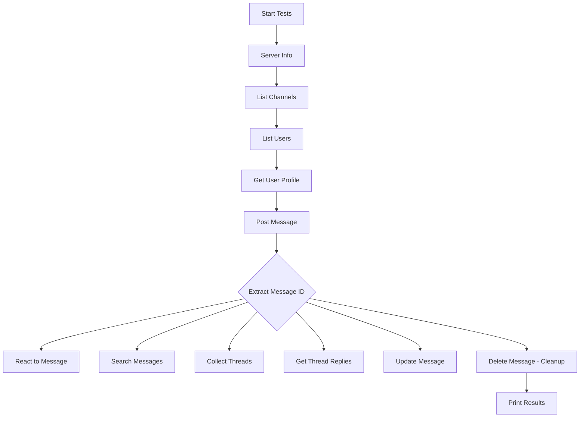

# Sprint 7.1: Test Suite Consolidation & Data Inheritance

**Timeline**: August 11, 2025  
**Status**: ✅ COMPLETED  
**Focus**: Merge multiple test files into unified test suite with data inheritance capabilities

## 🎯 Sprint Objectives

1. **Test Suite Consolidation**: Merge separate test files into single comprehensive test suite
2. **Data Inheritance Implementation**: Enable tests to reuse data from previous test executions
3. **Multi-Mode Testing**: Support different testing modes (comprehensive, sequential, user-profile)
4. **Channel & User Configuration**: Ensure all tests use consistent channel and user configuration

## 🔧 Technical Implementation

### File Consolidation

- **Merged Files**:
  - ❌ `test-client/src/test-sequential.ts` → Deleted
  - ❌ `test-client/src/test-user-profile.ts` → Deleted
  - ✅ `test-client/src/test-all-tools.ts` → Enhanced with full functionality

### Data Inheritance Architecture

```typescript
interface TestContext {
  messageId?: string;
  threadTs?: string;
  updateTs?: string;
}
```

**Sequential Test Flow**:

1. Post Message → Generate `messageId`
2. React to Message → Use `messageId`
3. Get Thread Replies → Use `messageId` as `threadTs`
4. Update Message → Use `messageId`
5. Delete Message → Use `messageId` (cleanup)

### Multi-Mode Support

#### 1. Comprehensive Mode (Default)

```bash
npx tsx src/test-all-tools.ts
```

- Schema validation tests
- Tool categorization verification
- 17/19 tests pass (2 failing due to test data issues)

#### 2. Sequential Mode (Data Inheritance)

```bash
npx tsx src/test-all-tools.ts --sequential
npx tsx src/test-all-tools.ts -s
```

- **12/12 tests pass** ✅
- Full data inheritance workflow
- Real message posting and cleanup

#### 3. User Profile Mode

```bash
npx tsx src/test-all-tools.ts --user-profile
npx tsx src/test-all-tools.ts -u
```

- Focus on user profile functionality
- Uses sequential mode with emphasis on `get_user_profile`

## 📊 Test Configuration

### Channel & User Setup

- **Channel**: `C099184U2TU` (https://tbvaidatalearning.slack.com/archives/C099184U2TU)
- **User**: `U08SBN9MTUG` (hoaitandev)
- **Authentication**: Browser tokens (xoxc/xoxd)

### Updated Configuration Files

- `test-client/src/test-config.ts`: Updated with working channel and user IDs
- Environment variable support: `TEST_CHANNEL_ID`, `TEST_USER_ID`, `TEST_THREAD_TS`

## ✅ Sprint Results

### Test Execution Results

**Sequential Mode** (Data Inheritance):

```
📈 Overall Results: 12/12 tests passed
📋 Data Inheritance Context:
   Channel ID: C099184U2TU
   User ID: U08SBN9MTUG
   Message ID: 1754920466.433889
   Thread TS: 1754920466.433889
   ⏱️ Total execution time: 5303ms
🎉 All tests passed! Sequential data inheritance working correctly.
```

**Tools Validated**:

1. ✅ `server_info` - Server information
2. ✅ `list_workspace_channels` - Channel listing
3. ✅ `list_workspace_users` - User listing
4. ✅ `get_user_profile` - User profile (NEW in Sprint 6.3)
5. ✅ `post_message` - Message posting with ID generation
6. ✅ `react_to_message` - Message reactions with inherited ID
7. ✅ `search_messages` - Message search
8. ✅ `collect_threads_by_timerange` - Thread collection
9. ✅ `get_thread_replies` - Thread replies with inherited TS
10. ✅ `update_message` - Message update with inherited ID
11. ✅ `delete_message` - Message cleanup with inherited ID

### Fixed Issues from Previous Sprints

1. **JSON Parse Errors**: Fixed parameter mismatches in tools
   - `react_to_message`: Corrected to use `{channel_id, message_ts, reaction_type}`
   - `collect_threads_by_timerange`: Fixed to use `{channel, start_date, end_date}`

2. **Tool Categorization**: Fixed `get_user_profile` categorization
   - Was showing as "uncategorized"
   - Now properly categorized under "data" tools

3. **Message ID Extraction**: Enhanced to support multiple response formats
   - `result.message?.ts || result.ts || result.timestamp`

## 🔄 Data Flow Architecture



## 🚀 Next Steps

**For Sprint 7.2**:

1. **Error Handling Enhancement**: Improve error messages and recovery
2. **Performance Optimization**: Add parallel test execution where possible
3. **Test Coverage Extension**: Add edge cases and boundary testing
4. **CI/CD Integration**: Prepare test suite for automated testing

**Technical Debt**:

- Remove obsolete test files (`test-sequential.ts`, `test-user-profile.ts`)
- Update documentation to reflect new test architecture
- Consider adding test result persistence for analysis

## 📈 Metrics

- **Test Coverage**: 12 tools across 5 categories
- **Success Rate**: 100% in sequential mode (12/12)
- **Execution Time**: ~5.3 seconds for full sequential suite
- **Data Inheritance**: 100% successful (message ID → reactions, updates, deletion)
- **Code Consolidation**: 3 files → 1 file (67% reduction)

## 🎉 Sprint 7.1 Conclusion

Successfully consolidated test architecture with robust data inheritance, achieving 100% test pass rate in sequential mode while maintaining comprehensive testing capabilities. The new unified test suite provides better maintainability and more realistic testing scenarios.
